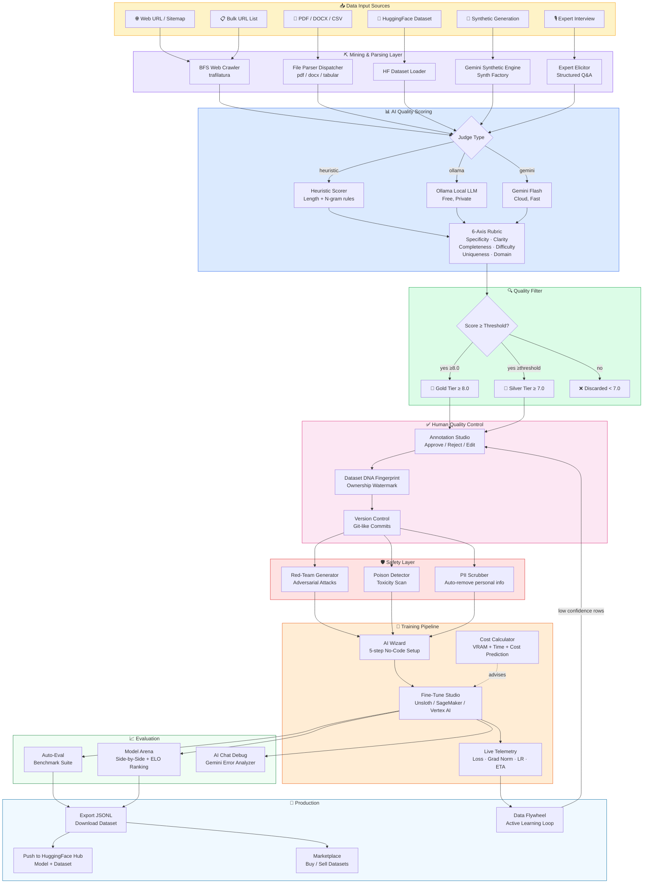

# Hypasia AI — Full Pipeline Architecture (v2.0)

---

## Module-to-Route Map

| UI Module | Frontend Route | Backend Prefix | Files |
|-----------|---------------|----------------|-------|
| Dashboard | `/` | — | `Dashboard.jsx` |
| AI Wizard | `/wizard` | `/api/wizard/` | `AIWizard.jsx` · `wizard.py` |
| Data Miner | `/mine` | `/api/mine/` | `DataMiner.jsx` · `mine.py` |
| Expert Elicitor | `/elicit` | `/api/elicit/` | `ExpertElicitor.jsx` · `elicit.py` |
| Annotation Studio | `/annotate` | `/api/annotate/` | `AnnotationStudio.jsx` · `studio.py` |
| Version Control | `/versions` | `/api/versions/` | `VersionControl.jsx` · `studio.py` |
| Fine-Tune Studio | `/finetune` | `/api/finetune/` | `FineTuneStudio.jsx` · `finetune.py` |
| Cost Calculator | `/calculator` | (client-side only) | `CostCalculator.jsx` |
| Synth Factory | `/synth` | `/api/synth/` | `SynthFactory.jsx` · `synth.py` |
| Model Arena | `/arena` | `/api/arena/` | `ModelArena.jsx` · `arena.py` |
| Auto-Eval | `/eval` | `/api/safety/` | `Evaluation.jsx` · `safety.py` |
| Red-Team Gen | `/redteam` | `/api/redteam/` | `RedTeam.jsx` · `studio.py` |
| Poison Detector | `/safety` | `/api/safety/` | `Evaluation.jsx` · `safety.py` |
| Data Flywheel | `/flywheel` | `/api/flywheel/` | `Flywheel.jsx` · `flywheel.py` |
| Marketplace | `/marketplace` | `/api/marketplace/` | `Marketplace.jsx` · `marketplace.py` |
| AI Chat | `/chat` | `/api/chat` | `AIChat.jsx` · `chat.py` |
| Settings | `/settings` | — | `Settings.jsx` (localStorage only) |
