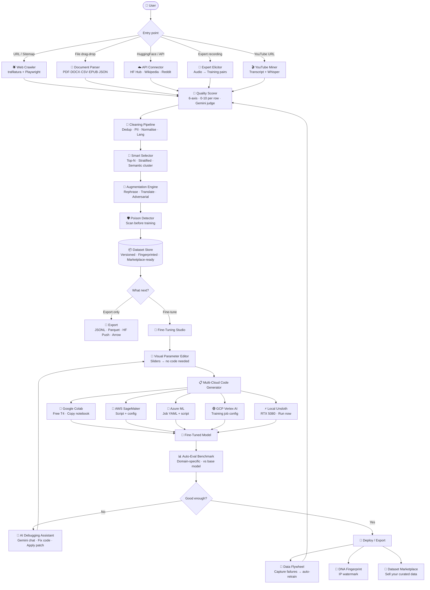

# Hypasia AI — Master Implementation Plan v3

> **Vision**: The only platform where raw internet → fine-tuned, deployed model happens in one UI with zero code required — and an AI assistant that fixes any problem along the way.

> [!CAUTION]
> **API Key Security**: Never commit API keys to code. All keys go into `.env` files only. The Gemini key shared in chat must be revoked immediately at https://aistudio.google.com and regenerated. A new key goes into `.env` only.

---

## Confirmed Configuration

| Setting | Value |
|---|---|
| CLI command | `hypasia` |
| LLM Judge | Gemini API (Google AI) |
| Local GPU | RTX 5080 8GB (Unsloth compatible ✅) |
| Fine-Tuning UI | Phase 2 web app |
| Marketplace architecture | Designed from day 1 |
| Cloud platforms | AWS SageMaker · GCP Vertex AI · Azure ML · Google Colab |

---

## High-Level Pipeline



---

## All 16 Modules

### Module 1 — Data Mining Engine *(Phase 1)*
Web crawler, document parser, API connectors, YouTube/audio miner.
**Stack**: trafilatura, Playwright, pdfplumber, python-docx, pandas, yt-dlp, whisper, datasets, huggingface_hub

### Module 2 — Quality Scorer *(Phase 1)*
6-axis scoring (0–10 each), Gemini-as-judge, composite weighted score, gold/silver/rejected tiers.
**Stack**: google-generativeai, sentence-transformers, spaCy, datasketch, langdetect

### Module 3 — Cleaning Pipeline *(Phase 1)*
Text normalisation, exact + near dedup, PII scrubbing, length filter, language filter, format repair.
**Stack**: ftfy, bleach, datasketch, presidio, langdetect, jsonrepair

### Module 4 — Smart Selector + Export *(Phase 1)*
Top-N, percentile cutoff, difficulty-stratified sampling, semantic clustering. Export JSONL/Parquet/HF.
**Stack**: faiss-cpu, scikit-learn, umap-learn, pyarrow, huggingface_hub

### Module 5 — Augmentation Engine *(Phase 2)*
LLM rephrase, harder variants, translation, adversarial examples. Async batching.
**Stack**: google-generativeai, asyncio, deep-translator

---

### 🔥 Module 6 — Fine-Tuning Studio *(Phase 2)* — CORE DIFFERENTIATOR
**No other platform goes from data → model in one UI.**

#### 6A. Model Browser
- Search HuggingFace Hub: filter by size, license, language, task
- Shows: VRAM requirement, recommended LoRA config, license compatibility
- One-click download to local `models/` folder
- Supports: Llama 3.x, Mistral, Phi-3/4, Qwen 2.5, Gemma 2, DeepSeek, Command-R

#### 6B. Visual Hyperparameter Editor
*User never touches code. Sliders and dropdowns only.*

| Parameter | Control | Range | Default |
|---|---|---|---|
| Base model | Dropdown | All HF models | Llama-3.2-3B |
| LoRA rank (r) | Slider | 4–256 | 16 |
| LoRA alpha | Slider | 8–512 | 32 |
| LoRA dropout | Slider | 0.0–0.1 | 0.05 |
| Learning rate | Input | 1e-6–1e-3 | 2e-4 |
| Batch size | Slider | 1–32 | 4 |
| Gradient accum. | Slider | 1–16 | 4 |
| Epochs | Slider | 1–10 | 3 |
| Max seq length | Slider | 512–8192 | 2048 |
| Optimizer | Dropdown | adamw_8bit, lion, etc. | adamw_8bit |
| Scheduler | Dropdown | cosine, linear, constant | cosine |
| Target modules | Checkboxes | q/k/v/o/gate/up/down | q,k,v,o |
| Quantization | Toggle | 4-bit QLoRA / bf16 | 4-bit |
| Warmup ratio | Slider | 0.0–0.1 | 0.03 |
| Dataset format | Dropdown | Alpaca/ShareGPT/ChatML/Raw | Alpaca |

#### 6C. Multi-Cloud Code Generator
One click → complete runnable scripts for 5 targets:

**Google Colab** — Free T4, copy-paste notebook with `!pip install` cells
**AWS SageMaker** — `estimator.py` + `training_job.json` + IAM policy template
**GCP Vertex AI** — `custom_job.py` + Dockerfile + `vertex_config.yaml`
**Azure ML** — `job.yaml` + `train.py` + environment spec
**Local Unsloth** — Direct Python script for RTX 5080 8GB (your GPU, pre-optimized)

Each generated script includes:
- All hyperparameters from the visual editor baked in
- Dataset loading from local path or HF Hub
- Checkpoint saving every N steps
- WandB / TensorBoard logging (optional)
- Estimated cost and time at the top as a comment

#### 6D. Cloud Credential Vault
User stores their own API keys securely (AES-256 encrypted at rest):
- Google Cloud Service Account JSON
- AWS Access Key ID + Secret
- Azure Subscription ID + credentials
- HuggingFace token (for push to Hub)
- Gemini / OpenAI / Anthropic keys (for LLM judge + augmentation)

Keys are used only to pre-fill cloud CLI commands in generated scripts. **We never see or log them.**

#### 6E. Step-by-Step Cloud Guides
For each platform, a visual walkthrough:
1. Where to paste the code
2. Which runtime to select (GPU type, memory)
3. Estimated cost breakdown
4. How to download the trained model
5. How to push to HF Hub

#### 6F. Local Runner (RTX 5080 8GB)
Run Unsloth directly from the UI. Live dashboard shows:
- Training loss curve (real-time)
- GPU VRAM usage bar
- Learning rate schedule
- Sample generations every N steps
- ETA to completion
- One-click pause / resume / stop

---

### 🔥 Module 7 — AI Debugging Assistant *(Phase 2)* — UNIQUE
**"My fine-tuning is failing on SageMaker — fix it."**

A chat interface powered by Gemini that:
1. **Understands your exact setup** — knows your model, dataset, hyperparameters, cloud platform
2. **Reads error messages** — paste or screenshot your error, it diagnoses it
3. **Generates a fix** — produces the corrected code snippet or config change
4. **Applies the patch** — one click applies the fix directly to your generated script
5. **Explains why** — teaches you what went wrong so you don't repeat it

*Example interactions:*
- "CUDA out of memory on T4" → reduces batch size + enables gradient checkpointing → applies fix
- "Loss is NaN after step 200" → detects LR too high → suggests + applies warmup fix
- "SageMaker IAM permission denied" → generates exact IAM policy JSON to add

**This feature alone justifies the Pro subscription. It's a $500/hour ML engineer in a chat box.**

---

### 🔥 Module 8 — Data Flywheel Engine *(Phase 3)* — ZERO COMPETITORS
Deploy your model → capture every failure → auto-improve. Users cannot churn without losing their model's accumulated intelligence.

**Components**:
- Lightweight Python SDK: `pip install hypasia-flywheel`
- REST webhook for any inference endpoint
- Thumbs up/down capture widget (embeddable)
- Auto-scoring of captured interactions
- Retraining trigger when queue hits N rows
- Dashboard: flywheel velocity (rows/day), quality trend over time

---

### 🔥 Module 9 — Expert Knowledge Elicitor *(Phase 2)* — ZERO COMPETITORS
Record a domain expert → auto-generate 500+ training pairs → fine-tune a specialist model.

**Workflow**:
1. Upload audio/video/text transcript of expert
2. Whisper transcription + speaker diarization
3. Pattern extraction: implicit "when X → do Y because Z" reasoning
4. Auto-generate instruction-response pairs
5. Expert review UI: approve / edit / reject each pair
6. Approved pairs feed directly into Fine-Tuning Studio

**Target customers**: Hospitals, law firms, financial institutions, defense — $5k+/month each.

---

### 🔥 Module 10 — Adversarial Red-Team Generator *(Phase 2)*
Auto-generate domain-specific adversarial test cases. Currently a $50k manual consulting service — we automate it.

- Jailbreak variants for your domain
- Edge case probes (boundary conditions)
- Contradictory instruction pairs
- Prompt injection attempts
- Ambiguous phrasing variants
- Output: adversarial JSONL with correct "safe handling" responses baked in

---

### 🔥 Module 11 — Auto-Eval Benchmark Generator *(Phase 2)*
From your training data → auto-generate domain-specific held-out evaluation set.

- Accuracy score: your fine-tuned model vs base model
- Regression detection: did new fine-tune break anything?
- Side-by-side output comparison UI
- Exportable benchmark for CI/CD pipelines (auto-run after every training run)

---

### 🔥 Module 12 — DNA Fingerprinting *(Phase 3)* — PATENT TERRITORY
Invisible cryptographic watermark embedded at the statistical level. Survives reformatting, re-ordering, metadata stripping.

- Verifier API: paste any dataset → we detect your fingerprint
- Legal evidence for IP claims
- Enterprise-only feature: $200+/month add-on

---

### 🔥 Module 13 — Training Data Poison Detector *(Phase 2)*
Scan any imported dataset for:
- Statistical anomalies suggesting injected patterns
- Backdoor trigger tokens
- Known poisoning signatures from published research
- Toxicity spikes in specific instruction patterns
- Semantic outliers (rows inconsistent with corpus)

**Compliance requirement for finance, healthcare, defense customers.**

---

### 🔥 Module 14 — Dataset Version Control *(Phase 2)*
Git-like versioning for datasets.
- Every pipeline run creates a versioned snapshot
- Diff viewer: what changed between v1 and v2?
- Rollback to any previous version
- Branch datasets (like git branch) for experiments
- Merge branches with conflict resolution

---

### 🔥 Module 15 — Collaborative Annotation Studio *(Phase 3)*
Multiple team members annotate, approve, reject rows in real-time.
- Role-based: annotator / reviewer / admin
- Disagreement resolution (majority vote or lead reviewer)
- Annotation speed metrics
- Inter-annotator agreement score (Cohen's Kappa)
- Like Label Studio — but natively integrated, no export/import friction

---

### 🔥 Module 16 — Dataset Marketplace *(Phase 3)*
Buy, sell, license curated datasets.
- Revenue split: 70% creator / 30% Hypasia AI
- Quality-gated: must score ≥ 7.5 composite to list
- DNA fingerprinted before listing
- Licensing: one-time, subscription, per-1000-rows
- Instant fine-tuning: buy a dataset → one click to Fine-Tuning Studio

---

## Project File Structure (Day-1 Architecture)

```
hypasia-ai/
├── .env.example                    # Template — never commit real keys
├── .gitignore
├── pyproject.toml                  # hypasia CLI entry point
├── docker-compose.yml             # Full stack local dev
├── README.md
│
├── src/hypasia/
│   ├── cli.py                      # Typer CLI — hypasia command
│   │
│   ├── mining/                     # Module 1
│   │   ├── crawler/
│   │   │   ├── web.py              # trafilatura static crawler
│   │   │   ├── playwright_ext.py   # JS-rendered pages
│   │   │   └── sitemap.py          # Sitemap XML parser
│   │   ├── parsers/
│   │   │   ├── dispatcher.py       # Route by file extension
│   │   │   ├── pdf.py              # pdfplumber
│   │   │   ├── docx.py             # python-docx
│   │   │   ├── tabular.py          # pandas CSV/Excel/Parquet
│   │   │   └── text.py             # TXT/MD/HTML/EPUB
│   │   └── connectors/
│   │       ├── huggingface.py      # HF Hub dataset import
│   │       ├── wikipedia.py        # Wikipedia dumps
│   │       └── youtube.py          # yt-dlp + whisper
│   │
│   ├── scorer/                     # Module 2
│   │   ├── heuristic.py            # Fast local scoring
│   │   ├── gemini_judge.py         # Gemini LLM-as-judge
│   │   └── composite.py            # Weighted average + tiers
│   │
│   ├── cleaner/                    # Module 3
│   │   ├── normalise.py            # ftfy, bleach
│   │   ├── dedup.py                # MD5 + MinHash LSH
│   │   ├── pii.py                  # presidio redaction
│   │   ├── length.py               # token length filter
│   │   └── language.py             # langdetect filter
│   │
│   ├── selector/                   # Module 4
│   │   ├── strategies.py           # Top-N, percentile, stratified
│   │   └── clustering.py           # FAISS + KMeans
│   │
│   ├── exporter/                   # Module 4
│   │   ├── jsonl.py
│   │   ├── parquet.py
│   │   └── hf_push.py
│   │
│   ├── augmentation/               # Module 5
│   │   ├── rephrase.py             # Gemini rewrite
│   │   ├── translate.py            # deep-translator
│   │   └── adversarial.py          # Red-team generation
│   │
│   ├── finetuning/                 # Module 6 — Fine-Tuning Studio
│   │   ├── model_browser.py        # HF Hub search + download
│   │   ├── config.py               # Hyperparameter schema
│   │   ├── codegen/
│   │   │   ├── colab.py            # Google Colab notebook gen
│   │   │   ├── sagemaker.py        # AWS SageMaker script gen
│   │   │   ├── vertex.py           # GCP Vertex AI script gen
│   │   │   ├── azure_ml.py         # Azure ML job gen
│   │   │   └── local_unsloth.py    # Local Unsloth script gen
│   │   ├── local_runner.py         # Direct Unsloth execution
│   │   └── vault.py                # Encrypted credential storage
│   │
│   ├── assistant/                  # Module 7 — AI Debugging Assistant
│   │   ├── chat.py                 # Gemini chat with context injection
│   │   ├── patcher.py              # Apply code fixes to scripts
│   │   └── error_patterns.py       # Common error → fix templates
│   │
│   ├── flywheel/                   # Module 8 — Data Flywheel
│   │   ├── sdk.py                  # pip install hypasia-flywheel
│   │   ├── webhook.py              # REST capture endpoint
│   │   └── trigger.py              # Auto-retrain logic
│   │
│   ├── elicitor/                   # Module 9 — Expert Knowledge
│   │   ├── transcribe.py           # Whisper + diarization
│   │   ├── extract.py              # Pattern → training pairs
│   │   └── review_ui.py            # Approval workflow
│   │
│   ├── redteam/                    # Module 10 — Adversarial Gen
│   │   └── generator.py
│   │
│   ├── eval/                       # Module 11 — Auto-Eval
│   │   ├── benchmark_gen.py
│   │   └── runner.py
│   │
│   ├── fingerprint/                # Module 12 — DNA Fingerprint
│   │   ├── embed.py
│   │   └── verify.py
│   │
│   ├── poison/                     # Module 13 — Poison Detector
│   │   └── scanner.py
│   │
│   ├── versioning/                 # Module 14 — Version Control
│   │   └── store.py
│   │
│   ├── annotation/                 # Module 15 — Collab Annotation
│   │   └── studio.py
│   │
│   ├── marketplace/                # Module 16 — Marketplace
│   │   ├── listings.py
│   │   └── licensing.py
│   │
│   ├── api/                        # FastAPI backend (Phase 2)
│   │   ├── main.py
│   │   ├── routers/
│   │   │   ├── jobs.py
│   │   │   ├── datasets.py
│   │   │   ├── finetuning.py
│   │   │   └── marketplace.py
│   │   └── models/                 # SQLAlchemy ORM models
│   │
│   └── db/                         # PostgreSQL models
│       ├── dataset.py
│       ├── job.py
│       ├── user.py
│       └── marketplace.py
│
├── frontend/                       # React + TypeScript (Phase 2)
│   ├── src/
│   │   ├── pages/
│   │   │   ├── Dashboard.tsx
│   │   │   ├── DataMining.tsx
│   │   │   ├── Scorer.tsx
│   │   │   ├── FineTuningStudio.tsx    # Module 6 UI
│   │   │   ├── AIAssistant.tsx         # Module 7 chat UI
│   │   │   ├── DataFlywheel.tsx        # Module 8 UI
│   │   │   ├── ExpertElicitor.tsx      # Module 9 UI
│   │   │   ├── Marketplace.tsx         # Module 16 UI
│   │   │   └── Settings.tsx            # Credential vault UI
│   │   └── components/
│   │       ├── HyperparamEditor.tsx    # Visual slider UI
│   │       ├── CodeViewer.tsx          # Monaco editor
│   │       ├── DatasetTable.tsx        # TanStack virtual table
│   │       ├── ScoreChart.tsx          # Recharts visualizations
│   │       └── TrainingMonitor.tsx     # Live loss curve
│
└── tests/
    ├── test_crawler.py
    ├── test_scorer.py
    ├── test_cleaner.py
    └── test_codegen.py
```

---

## Phase Execution Plan

### Phase 1 — CLI MVP (Weeks 1–4)
**Deliverable**: `hypasia run <url|file|hf-name>` → clean JSONL with scores.
- Modules 1, 2, 3, 4 (core only)
- Gemini-as-judge wired in from day 1
- 10 real users from r/LocalLLaMA

### Phase 2 — Web App + Studio (Weeks 5–16)
**Deliverable**: Full UI with Fine-Tuning Studio, AI Assistant, cloud code gen.
- React frontend + FastAPI + Celery + Redis + PostgreSQL
- Modules 5, 6, 7, 9, 10, 11, 13, 14
- Local runner tested on RTX 5080 8GB
- Colab / SageMaker / Vertex / Azure code generators
- Step-by-step cloud guides per platform

### Phase 3 — Paid + Flywheel (Months 3–5)
**Deliverable**: Revenue. $5k MRR target.
- Modules 8, 12, 15, 16
- Stripe billing
- Dataset Marketplace live
- DNA Fingerprinting
- Collaborative Annotation Studio

### Phase 4 — Enterprise (Months 6–12)
**Deliverable**: $500–$5000/month contracts.
- On-premise Docker deployment
- SAML/SSO
- Custom scoring models
- Audit logs + compliance exports
- Dedicated Flywheel instances per customer

---

## Business Model (Final)

| Tier | Price | Key differentiator |
|---|---|---|
| **Starter** | Free | 50k rows · 5 URLs · Basic scorer · Code generator (view only) |
| **Pro** | $49/mo | 5M rows · Full scorer (Gemini judge) · Augmentation · Fine-Tune Studio · AI Debugging Assistant |
| **Studio** | $149/mo | Pro + Flywheel SDK · Poison Detector · Red-Team Gen · Eval Benchmark · Version Control |
| **Team** | $299/mo | Studio + Collaborative Annotation · Team workspaces · Priority queue |
| **Enterprise** | $500–5000/mo | On-prem · DNA Fingerprinting · Marketplace seller · Custom judge · SAML · SLA |

---

## Tech Stack (Final)

| Layer | Technology |
|---|---|
| CLI framework | Typer + Rich |
| Web crawler | trafilatura + Playwright |
| Document parsing | pdfplumber + python-docx + pandas + pyarrow |
| LLM judge | google-generativeai (Gemini) |
| Embeddings + dedup | sentence-transformers + datasketch + faiss-cpu |
| PII scrubbing | presidio-analyzer + presidio-anonymizer + spaCy |
| Text cleaning | ftfy + bleach + langdetect |
| Fine-tuning engine | Unsloth (local, RTX 5080 8GB) |
| Code generation | Jinja2 templates → Colab/SageMaker/Vertex/Azure |
| AI assistant | google-generativeai with context injection |
| Backend API | FastAPI + SQLAlchemy + Alembic |
| Job queue | Celery + Redis |
| Database | PostgreSQL |
| File storage | S3 / MinIO |
| Frontend | React + TypeScript + Vite |
| UI components | Shadcn/ui + Radix UI |
| Data table | TanStack Table (virtual scrolling, 1M+ rows) |
| Charts | Recharts |
| Code editor | Monaco Editor (same as VS Code) |
| Deployment | Docker Compose → Railway → Kubernetes |
